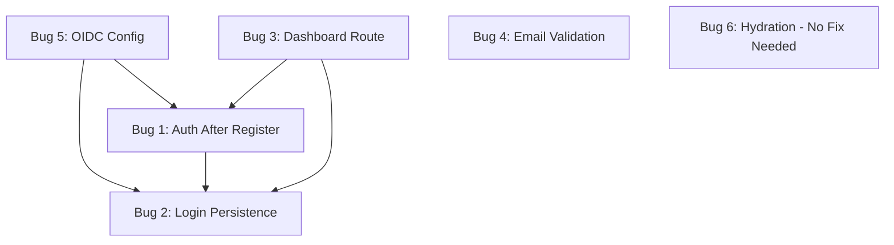

# Bug Fix Plan - Registration and Login Flow

This document provides a detailed plan to fix each bug from `BUG_REPORT.md`. Each section analyzes root cause, proposes a solution, identifies affected files, and outlines implementation steps.

---

## Bug 1: Authentication Error after Registration

**Description**: After successful registration, `completeProfile` mutation fails with `Uncaught Error: Not authenticated`.

### Root Cause Analysis

The issue is a **race condition** between registration and profile completion:

1. User submits registration form in [`RegisterForm.tsx`](file:///Users/michal/Documents/MyApps/WalkWithMe/src/components/RegisterForm.tsx)
2. `signIn("password", formData)` is called (with `flow: "signUp"`)
3. Navigation to `/complete-profile` happens **immediately after** `signIn()` resolves
4. The Convex auth session may not be fully established on the backend yet
5. `completeProfile` mutation in [`CompleteProfileForm.tsx`](file:///Users/Documents/MyApps/WalkWithMe/src/components/CompleteProfileForm.tsx) runs before auth session is ready
6. [`users.ts:completeProfile`](file:///Users/michal/Documents/MyApps/WalkWithMe/convex/users.ts#L16-L35) throws "Not authenticated" because `getAuthUserId(ctx)` returns `null`

### Proposed Solution

1. **Wait for auth session confirmation** before navigating to `/complete-profile`
2. Use a query to verify the user is authenticated before proceeding
3. Add loading/error states to handle the transition gracefully

### Affected Files

| Action | File                                                                                                               |
| ------ | ------------------------------------------------------------------------------------------------------------------ |
| MODIFY | [RegisterForm.tsx](file:///Users/michal/Documents/MyApps/WalkWithMe/src/components/RegisterForm.tsx)               |
| MODIFY | [CompleteProfileForm.tsx](file:///Users/michal/Documents/MyApps/WalkWithMe/src/components/CompleteProfileForm.tsx) |

### Implementation Steps

1. In `RegisterForm.tsx`:
   - After `signIn()`, wait for `api.users.current` to return a non-null user before navigating
   - Add a polling mechanism or use `Authenticated` component from `@convex-dev/auth/react`

2. In `CompleteProfileForm.tsx`:
   - Add `useQuery(api.users.current)` to verify user is authenticated before showing form
   - Show loading state while auth is being confirmed
   - Add error handling for unauthenticated state with redirect to `/login`

---

## Bug 2: Login Persistence Failure

**Description**: After logging in, UI still shows "Sign In" / "Get Started" instead of authenticated state.

### Root Cause Analysis

The issue is in [`Navbar.tsx`](file:///Users/michal/Documents/MyApps/WalkWithMe/src/components/Navbar.tsx) and the auth state propagation:

1. `useQuery(api.users.current)` in Navbar checks if user exists
2. After login, the `LoginForm` navigates to `/` immediately
3. The Navbar may render before the auth state is fully propagated
4. `user` could be `undefined` (loading) or `null` (query executed before session established)

The current Navbar code:

```tsx
const user = useQuery(api.users.current)
// ...
{user ? (...authenticated UI...) : (...unauthenticated UI...)}
```

This treats `undefined` (loading) the same as `null` (not authenticated), showing "Sign In".

### Proposed Solution

1. **Distinguish between loading and unauthenticated states**
2. Use `useConvexAuth()` hook from `@convex-dev/auth/react` for reliable auth state
3. Only render unauthenticated UI when we're **certain** the user is not logged in

### Affected Files

| Action | File                                                                                           |
| ------ | ---------------------------------------------------------------------------------------------- |
| MODIFY | [Navbar.tsx](file:///Users/michal/Documents/MyApps/WalkWithMe/src/components/Navbar.tsx)       |
| MODIFY | [LoginForm.tsx](file:///Users/michal/Documents/MyApps/WalkWithMe/src/components/LoginForm.tsx) |

### Implementation Steps

1. In `Navbar.tsx`:
   - Import `useConvexAuth` from `@convex-dev/auth/react`
   - Use `const { isAuthenticated, isLoading } = useConvexAuth()`
   - Show loading indicator when `isLoading` is true
   - Use `isAuthenticated` as the primary auth check
   - Keep `user` query for profile data but don't use it for auth state

2. In `LoginForm.tsx`:
   - After `signIn()`, verify auth state before navigating
   - Consider redirecting to `/dashboard` instead of `/` for better UX

---

## Bug 3: Missing Dashboard Route

**Description**: Navigating to `/dashboard` returns a 404 Not Found.

### Root Cause Analysis

The route file exists at [`src/routes/dashboard.tsx`](file:///Users/michal/Documents/MyApps/WalkWithMe/src/routes/dashboard.tsx) and appears correctly configured with TanStack Router's file-based routing.

Possible causes:

1. Route not being picked up by TanStack Router's code generation
2. Build/dev server cache issue
3. Route generation configuration problem

### Proposed Solution

1. Verify TanStack Router configuration
2. Check if `.tanstack` directory has the generated route tree
3. Ensure `dashboard.tsx` exports follow TanStack Router conventions
4. Force regeneration of routes

### Affected Files

| Action | File                                                                                       |
| ------ | ------------------------------------------------------------------------------------------ |
| VERIFY | [dashboard.tsx](file:///Users/michal/Documents/MyApps/WalkWithMe/src/routes/dashboard.tsx) |
| VERIFY | [vite.config.ts](file:///Users/michal/Documents/MyApps/WalkWithMe/vite.config.ts)          |
| VERIFY | `.tanstack/routes.gen.ts` (generated file)                                                 |

### Implementation Steps

1. Verify `dashboard.tsx` exports the route correctly:

   ```tsx
   export const Route = createFileRoute('/dashboard')({...})
   ```

2. Check `.tanstack` directory for generated routes

3. Restart dev server to force route regeneration:

   ```bash
   # Stop dev server
   # Delete .tanstack directory
   rm -rf .tanstack
   # Restart
   npm run dev
   ```

4. If still not working, check `vite.config.ts` for TanStack Router plugin configuration

---

## Bug 4: Email Validation Issue

**Description**: Email input rejects valid emails with `+` characters (e.g., `user+test@example.com`).

### Root Cause Analysis

The email inputs in [`LoginForm.tsx`](file:///Users/michal/Documents/MyApps/WalkWithMe/src/components/LoginForm.tsx) and [`RegisterForm.tsx`](file:///Users/michal/Documents/MyApps/WalkWithMe/src/components/RegisterForm.tsx) use `type="email"`.

The browser's native email validation for `type="email"` **should** accept `+` characters as they are valid per RFC 5322. The issue might be:

1. Custom validation pattern on the input
2. Backend validation rejecting the `+`
3. Form encoding issue where `+` is being converted to space

Looking at the current code:

```tsx
<Input type="email" placeholder="you@example.com" required />
```

No custom pattern is set, so this is likely a backend or encoding issue.

### Proposed Solution

1. Verify if the issue is client-side or server-side
2. If client-side: Ensure no custom validation pattern rejects `+`
3. If server-side (Convex Auth): Configure email validation to accept `+`
4. Ensure proper form data encoding

### Affected Files

| Action          | File                                                                                                 |
| --------------- | ---------------------------------------------------------------------------------------------------- |
| VERIFY          | [LoginForm.tsx](file:///Users/michal/Documents/MyApps/WalkWithMe/src/components/LoginForm.tsx)       |
| VERIFY          | [RegisterForm.tsx](file:///Users/michal/Documents/MyApps/WalkWithMe/src/components/RegisterForm.tsx) |
| POSSIBLY MODIFY | [auth.ts](file:///Users/michal/Documents/MyApps/WalkWithMe/convex/auth.ts)                           |

### Implementation Steps

1. Test in browser DevTools to identify where validation fails

2. If client-side, add explicit pattern that allows `+`:

   ```tsx
   <Input
     type="email"
     pattern="[a-zA-Z0-9._%+-]+@[a-zA-Z0-9.-]+\.[a-zA-Z]{2,}"
   />
   ```

3. If Convex Auth Password provider issue, configure email validation:

   ```tsx
   // convex/auth.ts
   import { Password } from '@convex-dev/auth/providers/Password'

   export const { auth, signIn, signOut, store } = convexAuth({
     providers: [
       Password({
         profile(params) {
           return {
             email: params.email, // Ensure raw email is passed
             name: params.name,
           }
         },
       }),
     ],
   })
   ```

4. Consider URL-encoding form data if `+` is being converted to space

---

## Bug 5: Critical OIDC Token Verification Failure

**Description**: Authentication fails with "Could not verify OIDC token claim. Check that the token signature is valid and the token hasn't expired."

### Root Cause Analysis

This is a configuration issue with Convex Auth's OIDC setup. The error indicates:

1. The `CONVEX_SITE_URL` in [`auth.config.ts`](file:///Users/michal/Documents/MyApps/WalkWithMe/convex/auth.config.ts) may not match the actual deployment URL
2. Token signing/verification keys mismatch between dev and production
3. Environment variable `CONVEX_SITE_URL` not properly set
4. Time synchronization issues (token appears expired)

Current config:

```ts
export default {
  providers: [
    {
      domain: process.env.CONVEX_SITE_URL,
      applicationID: 'convex',
    },
  ],
}
```

### Proposed Solution

1. Verify `CONVEX_SITE_URL` environment variable is correctly set
2. Ensure it matches the actual Convex HTTP Actions URL
3. Set `AUTH_JWT_PRIVATE_KEY` environment variable for consistent token signing
4. Verify `.env.local` has all required auth variables

### Affected Files

| Action          | File                                                                                     |
| --------------- | ---------------------------------------------------------------------------------------- |
| VERIFY          | [auth.config.ts](file:///Users/michal/Documents/MyApps/WalkWithMe/convex/auth.config.ts) |
| VERIFY          | [.env.local](file:///Users/michal/Documents/MyApps/WalkWithMe/.env.local)                |
| POSSIBLY MODIFY | Convex dashboard environment variables                                                   |

### Implementation Steps

1. Verify `.env.local` contains:

   ```
   CONVEX_SITE_URL=https://your-deployment.convex.site
   ```

   The URL should be the Convex HTTP Actions URL, not the frontend URL.

2. Set up JWT private key for consistent token signing:

   ```bash
   # Generate a secure random key
   openssl rand -base64 32
   ```

   Add to Convex dashboard as `AUTH_JWT_PRIVATE_KEY`.

3. In Convex dashboard, verify environment variables:
   - `CONVEX_SITE_URL`
   - `AUTH_JWT_PRIVATE_KEY`

4. Update `auth.config.ts` if needed:

   ```ts
   export default {
     providers: [
       {
         domain: process.env.CONVEX_SITE_URL,
         applicationID: 'convex',
       },
     ],
   }
   ```

5. Redeploy Convex functions:
   ```bash
   npx convex deploy
   ```

---

## Bug 6: Hydration Mismatch

**Description**: React hydration mismatch warning for `data-jetski-tab-id` prop.

### Root Cause Analysis

The warning `Prop 'data-jetski-tab-id' did not match` indicates:

1. **Browser extension interference**: "Jetski" is likely a browser extension injecting attributes into the DOM
2. The extension adds `data-jetski-tab-id` to elements during SSR/hydration
3. Server-rendered HTML doesn't include this attribute, but client-side does

This is **NOT an application bug** but caused by external browser extensions.

### Proposed Solution

1. **Suppress the warning** in development (not recommended for production)
2. **Educate users** about browser extension interference
3. **No code changes needed** - this is external to the application

### Affected Files

None - this is caused by browser extensions.

### Implementation Steps

1. **Recommended approach**: Ignore this warning as it's caused by browser extensions like "Jetski Tab Manager" or similar.

2. **For debugging**: Test in an incognito window without extensions to confirm the app works correctly.

3. **Optional suppression** (not recommended):

   ```tsx
   // In development only, suppress specific hydration warnings
   // This is generally not recommended as it may hide real issues
   ```

4. **Document in README** that hydration mismatches caused by browser extensions are expected and harmless.

---

## Summary Table

| Bug # | Severity | Category            | Estimated Effort |
| ----- | -------- | ------------------- | ---------------- |
| 1     | Critical | Auth Race Condition | Medium           |
| 2     | Critical | State Management    | Low-Medium       |
| 3     | Major    | Route Configuration | Low              |
| 4     | Minor    | Validation          | Low              |
| 5     | Critical | OIDC Configuration  | Medium           |
| 6     | Moderate | External (Browser)  | None             |

## Recommended Fix Order

1. **Bug 5** (OIDC) - Most fundamental, blocks all auth
2. **Bug 1** (Auth Error after Registration) - Blocks registration flow
3. **Bug 2** (Login Persistence) - Core auth UX
4. **Bug 3** (Dashboard Route) - Quick verification/fix
5. **Bug 4** (Email Validation) - Minor, low priority
6. **Bug 6** (Hydration) - No action needed

---

## Dependencies Between Bugs



Fixing Bug 5 (OIDC) is a prerequisite for verifying bugs 1 and 2 are truly fixed, as the underlying auth mechanism must work first.
